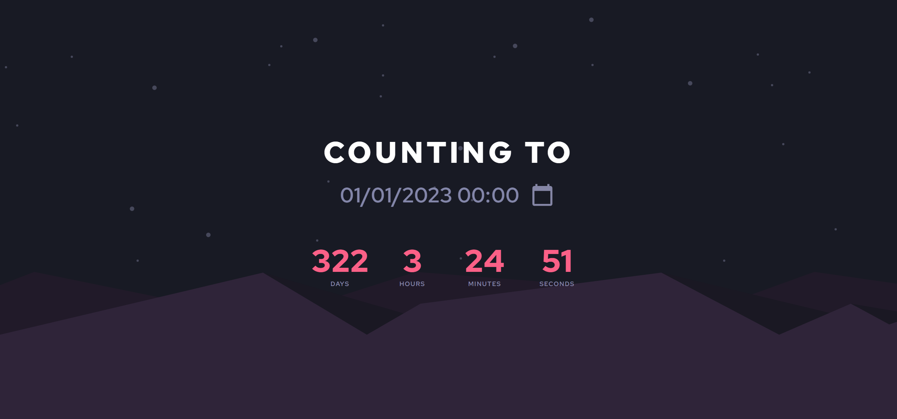

# ⌛[Countdown Maker](https://nick-gabe.github.io/countdown-website)

### Links

- Website URL: [Click here](https://nick-gabe.github.io/countdown-website)

## My process

### Built with

- Semantic HTML5 markup
- CSS custom properties
- Flexbox
- CSS Grid
- Desktop-first workflow
- Basic Language system
- Bootstrap
- Scss

### What I learned

I learned a lot with this project, for example generating content based on queries, how to make link previews, syncinc timers and etc...

### Useful resources

- ["Share on Twitter" Button](https://help.twitter.com/en/using-twitter/add-twitter-share-button)

## Author

- Frontend Mentor - [@Nick-Gabe](https://www.frontendmentor.io/profile/Nick-Gabe)
- CodePen - [@Nick-Gabe](https://codepen.io/nick-gabe)
- GitHub - [@Nick-Gabe](https://github.com/Nick-Gabe/)
- Twitter - [@MyNickIsNick_](https://www.twitter.com/MyNickIsNick_)